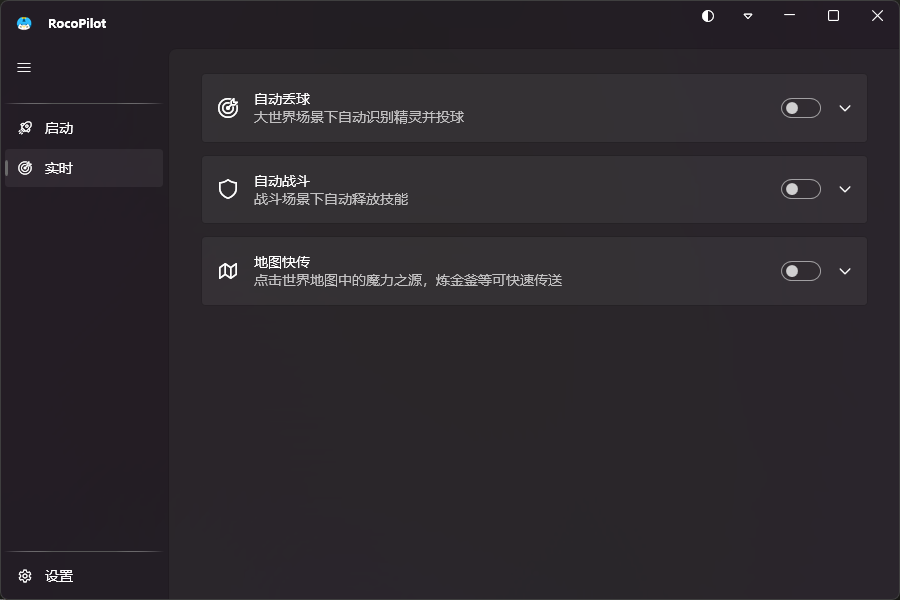

<p align="center"><a href="README.md">简体中文</a> | English</p>

<p align="center">
  
</p>

<h1 align="center">RocoPilot</h1>

<p align="center">A Windows automation toolbox for the Roco Kingdom: World PC client<br>Multiple automation features powered by computer vision</p>

<p align="center">
  <a href="https://dotnet.microsoft.com/download/dotnet/9.0"></a>
  <a href="https://github.com/lepoco/wpfui"></a>
  <a href="https://github.com/ultralytics/ultralytics"></a>
  
  <a href="https://github.com/oblitum/Interception"></a>
  <a href="https://velopack.io"></a>
  <a href="LICENSE"></a>
</p>

## Features

- **Auto Throw** — Recognizes wild spirits in the open world, auto-centers the camera, aims and throws balls to keep catching
- **Auto Battle** — Recognizes battle scenes and casts skills automatically to finish rounds
- **Fast Travel** — Recognizes the world map and clicks the teleport button after you pick a map element such as the Magic Source or the Alchemy Cauldron
- **Central Dispatch** — Detects the current game scene and switches tools automatically, no manual intervention
- **Dynamic Island OSD** — A floating status window above the game screen showing live state and key readings
- **Auto Pause on Focus Loss** — Suspends everything when the game window loses focus, resumes when it regains focus
- **Auto Updates** — Velopack delta updates with stable / beta channels

Computer vision + simulated mouse & keyboard only — no memory reading, no injection, no hooking

## Showcase

Main window — tool overview:



Dynamic Island OSD — floating status window:


## Getting the Software

Only a **beta** channel exists for now; build it yourself: clone the repo and run one of the two commands below. Output lands in `publish/`, run `RocoPilot.exe` directly

**Self-contained** — bundles the .NET Runtime, runs out of the box:

```
dotnet publish src/RocoPilot.Shell -c Release -r win-x64 --self-contained true -o publish
```

**Framework-dependent** — smaller, but requires the .NET 9 Desktop Runtime:

```
dotnet publish src/RocoPilot.Shell -c Release -r win-x64 --self-contained false -o publish
```

A **stable** installer will be published later on the Releases page, with in-app delta upgrades

## Requirements

- Windows 10 / 11
- [.NET 9 Desktop Runtime](https://dotnet.microsoft.com/download/dotnet/9.0) (only for the framework-dependent build; the self-contained build needs nothing)
- **Interception driver** (kernel-level input simulation, one-time install):

  1. Download the latest zip from [Interception Releases](https://github.com/oblitum/Interception/releases) and extract it
  2. Open a command prompt **as administrator** and enter the `command line installer` folder:
     ```
     cd Interception\command line installer
     ```
  3. Install:
     ```
     install-interception.exe /install
     ```
  4. **Reboot** after the success message (the driver only loads after a reboot)
  5. Verify the service state, the output must contain `STATE : 4 RUNNING`:
     ```
     sc query interception
     ```
  6. To uninstall:
     ```
     install-interception.exe /uninstall
     ```
     A reboot is required afterwards; if file deletion fails, reboot and run the uninstall once more

  > If installation fails, check whether your antivirus blocked the driver from writing to `C:\Windows\System32\drivers`

## Quick Start

1. Launch the **Roco Kingdom: World** PC client
2. Install the Interception driver on first use and reboot (see Requirements)
3. Run RocoPilot and click **Start Capturer** on the Launch page
4. Toggle the tools you want on the Realtime page; the central dispatcher switches tools by game scene automatically
5. Switching away from the game pauses everything; switching back resumes automatically

## Disclaimer

This project is licensed under [GPL-3.0](LICENSE)

This project is intended for learning and research only. Using this tool may violate the game's terms of service; any risk or consequence arising from its use is borne solely by the user

Questions and suggestions are welcome via [Issues](https://github.com/CHA1007/RoCoPilot/issues)
