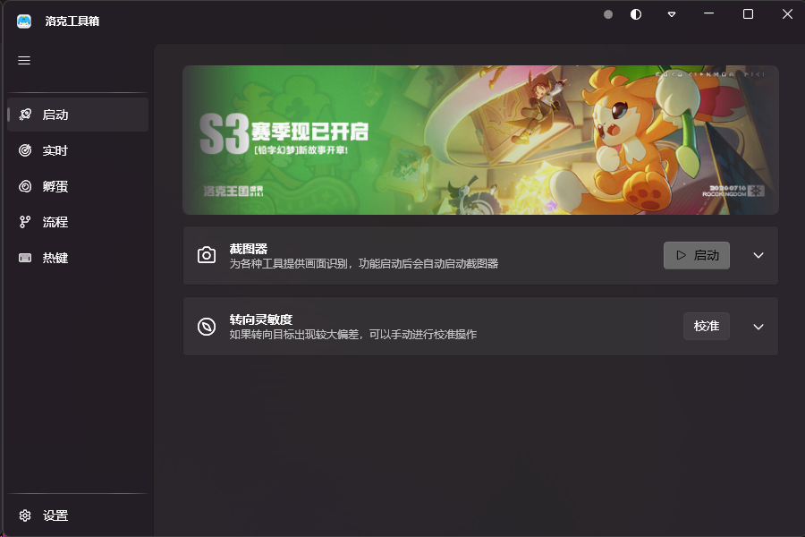

<a href="README.md">简体中文</a> | English

  

<h1 align="center">RocoPilot</h1>

A Windows automation toolbox for the Roco Kingdom: World PC client Multiple automation features powered by computer vision

  
  
  
  
  
  
  

## Features

- **Auto Throw** — Recognizes wild spirits in the open world, auto-centers the camera, aims and throws balls to keep catching
- **Auto Battle** — Recognizes battle scenes and casts skills automatically to finish rounds
- **Fast Travel** — Recognizes the teleport button on the world map with auto or custom key-press triggering; after picking a map element such as the Magic Source or Alchemy Cauldron, completes the teleport automatically
- **Route Replay** — Compose and loop an execution chain of Teleport / Delay / Script Replay steps; teleport locates anchors by geometrically aligning the in-game map against the built-in Magic Source catalog, and a failed leg reruns from the nearest upstream teleport, enabling automated map runs and more
- **Egg Query** — Ships with full spirit egg group data; look up a spirit's egg groups, or find all spirits that can breed together in a group
- **Central Dispatch** — Detects the current game scene and switches tools automatically, no manual intervention
- **Dynamic Island OSD** — A floating status window above the game screen showing live state and key readings
- **Auto Pause on Focus Loss** — Suspends everything when the game window loses focus, resumes when it regains focus

Computer vision + simulated mouse & keyboard only

## Showcase

Launch screen:

Dynamic Island OSD — floating status window:

## Getting the Software

A **beta** is available now, download it from the [Releases page](https://github.com/CHA1007/RoCoPilot/releases):

- `RocoPilot-<version>-Setup.exe` — a single-file installer; download it and double-click to install

A **stable** release will be published later, downloadable from the Releases page with in-app delta upgrades

## Requirements

- Windows 10 / 11

## Quick Start

1. Launch the **Roco Kingdom: World** PC client
2. On first use, install the Interception kernel driver (tick it in the installer, or install it from the **Launch** page of RocoPilot) and reboot for it to take effect
3. Run RocoPilot and toggle the tools you want on the Realtime page; the capturer starts automatically and the central dispatcher switches tools by game scene
4. To automate map runs, compose a route of Teleport / Delay / Script Replay steps on the Route page and run it
5. Switching away from the game pauses everything; switching back resumes automatically

## Data Sources

- The egg group and artwork data used by the Egg Query feature comes from the
  [Roco Kingdom Mobile WIKI](https://wiki.biligame.com/rocom/) (egg group calculator / egg group lookup page),
  licensed under **CC BY-NC-SA 4.0** (Attribution-NonCommercial-ShareAlike) and used for learning and research only.
  See [assets/data/README.md](assets/data/README.md) for licensing details of the data files themselves.
- The Magic Source anchor catalog (name + world coordinates) embedded for Route Replay is compiled from WIKI map data, used for learning and research only.

## Disclaimer

This project is licensed under [GPL-3.0](LICENSE)

This project is intended for learning and research only. Using this tool may violate the game's terms of service; any risk or consequence arising from its use is borne solely by the user

Questions and suggestions are welcome via [Issues](https://github.com/CHA1007/RoCoPilot/issues)
